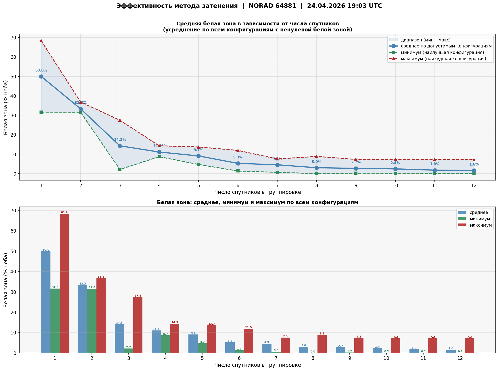

# Уточнение локализации гамма-всплесков методом затенения Земли

## О проекте

Разработка методики уточнения локализации космических гамма-всплесков (GRB) с помощью анализа затенения небесной сферы Землёй. В работе используются данные с кубсата 239Alferov (NORAD ID: 64881), запущенного 25 июля 2025 года на солнечно-синхронную орбиту.

## Принцип метода

Одиночный кубсат регистрирует гамма-всплеск, но не способен определить направление на источник. Метод использует затенение неба Землёй для исключения направлений:

- Спутник зафиксировал всплеск — источник находится вне области затенения.
- Спутник не зафиксировал всплеск — источник находится внутри области затенения.

Области затенения спутников, не зафиксировавших сигнал, логически перемножаются и исключаются из зоны поиска. Оставшаяся открытая область — возможное направление на источник.

## Инструменты

- Язык: Python 3.9+
- Библиотеки: NumPy, Matplotlib, Skyfield, mhealpy
- Данные: TLE (Two-Line Elements), источник — Celestrak

## Состав репозитория

| Файл | Назначение |
|:--|:--|
| Затенение прямоугольная проекция.py | Построение областей затенения в координатах RA, Dec |
| Затенение проекция Mollweide.py | Построение областей затенения в проекции Mollweide |
| Расчёт затенение для 1 спутника.py | Расчёт доли затенённой сферы для одиночного аппарата |
| Расчёт_затенения_Linux.py | Версия для Linux |
| Расчёт_затенения_WINDOWS.py | Версия для Windows |
| Орбита 239Alferov.py | Проекция орбиты кубсата на поверхность Земли |
| Анализ эффективности.py | Анализ эффективности метода при увеличении числа спутников (от 1 до 12) |

## Результаты

### Одиночный спутник и группировка из четырёх

- Средняя доля затенённой небесной сферы для одного спутника: 31,6 %.
- Угловой радиус затенения: 60–65 градусов (зависит от точки орбиты).
- Для группировки из 4 спутников открытая область сужается до 9–15 % (зависит от числа аппаратов, зафиксировавших всплеск).

### Анализ эффективности (1–12 спутников)

Проведён перебор всех комбинаций регистрации всплеска для группировок от 1 до 12 спутников. Конфигурации с нулевой открытой областью исключены как физически невозможные. По оставшимся вычислены средняя, минимальная и максимальная открытая область.

Ключевой вывод: с ростом числа спутников открытая область монотонно убывает. При 12 спутниках средняя открытая область снижается до нескольких процентов небесной сферы, а минимальная (наилучшая конфигурация) приближается к 1 %.

## Авторы

Белоконев Константин, Бисенов Эмильен
«Физико-техническая школа» им. Ж.А. Алферова РАН, Санкт-Петербург

Научный руководитель: Свинкин Д.С., к.ф.-м.н., ФТИ им. А.Ф. Иоффе
